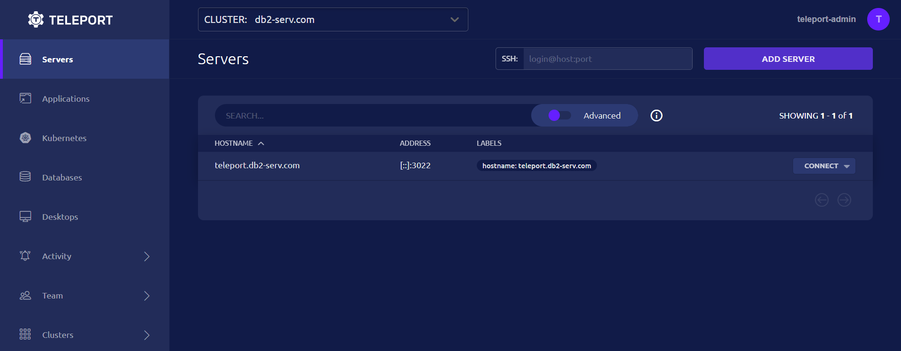

# Teleport Installation and Setup Guide:-

Teleport is an open-source tool for secure access to infrastructure, available in Community and Enterprise editions. This guide focuses on the Community Edition for setting up secure SSH access to Linux servers, with features like single sign-on, short-lived certificates, and auditing.

## 🧰 Architecture Overview

> *Teleport Cluster Setup*

For a **production setup**, adhere to best practices to enhance security and reliability:

- Avoid using `sudo` unless necessary; create non-root users for experimentation.
- Run Teleport services as non-root users where possible (SSH service requires root or `CAP_NET_BIND_SERVICE` capability for ports <1024).
- Follow the principle of least privilege: Assign minimal roles and use Access Requests for temporary elevations.
- Use proper TLS certificates (avoid self-signed; prefer ACME/Let's Encrypt for automatic renewal).
- Implement high availability with multiple Auth and Proxy nodes, load balancers, and shared backends like etcd.
- Enable multi-factor authentication (MFA) and per-session MFA for added security.
- Save sensitive tokens to files instead of entering them on the command line to prevent exposure.
- Monitor logs and enable debug mode if troubleshooting is needed.
- Ensure DNS resolution, firewall rules, and ports (e.g., 3023-3025, 3080, 443) are configured for production scalability.

This guide assumes an AWS EC2 instance with Amazon Linux, but adapt for your environment. Replace example domains (e.g., `teleport.example.com`) with your own.

## Prerequisites

- 🔑 A domain name for Teleport (e.g., `teleport.example.com`) with DNS A records pointing to your server's IP.
- 🔒 Valid TLS certificates (use ACME in config for auto-renewal; self-signed only for testing).
- 🛡️ Open ports: 443 (HTTPS), 3023-3025 (internal), and SSH (22) in security groups.
- 📦 Amazon Linux EC2 instance with root access.
- ⚠️ For production: Backup configurations, enable logging to a central system, and test in a staging environment first.


## Step 1: Prepare the EC2 Instance

1. 🚀 Spin up an EC2 instance on the AWS console and note its private IP.
2. 🔓 Open ports 22 (SSH) and 443 (HTTPS) in the security group.
3. 🔑 Log in to the EC2 instance via SSH.

Teleport requires TLS for secure Proxy and Auth services, so ensure a resolvable domain for certificate verification.

## Step 2: Configure Hostname and Certificates

1. 📛 Set DNS-resolvable hostname for the Teleport server:
    - Check current hostname: `hostname`
    - Set hostname: `hostnamectl set-hostname teleport.example.com`
    - Map private IP to DNS in hosts file: `echo "10.42.55.21 teleport.example.com teleport" >> /etc/hosts`
    - Verify: `cat /etc/hosts`

If no public SSL certificate is available, generate a self-signed one (not recommended for production; use ACME instead).

**Note:** Certificates must match your domain (e.g., `teleport.example.com`). Replace details accordingly.

Generate self-signed certificate (for testing only):

```
openssl req -x509 -nodes -newkey rsa:4096 \
  -keyout /var/lib/teleport/teleport.key \
  -out /var/lib/teleport/teleport.pem -sha256 -days 3650 \
  -subj "/C=US/ST=Virginia/L=Virginia/O=Org/OU=Dept/CN=teleport.example.com"
```

For production, enable ACME in the config for automatic certificates from Let's Encrypt.

## Step 3: Install and Configure Teleport

1. 🔄 Update the system: `yum update`
2. 📦 Add Teleport repository: `yum-config-manager --add-repo https://rpm.releases.teleport.dev/teleport.repo`
3. 🛠️ Install Teleport: `yum install teleport`

Generate configuration file (after setting domain and certs):

```
teleport configure -o /etc/teleport.yaml \
  --cluster-name=teleport.example.com \
  --public-addr=teleport.example.com:443 \
  --cert-file=/var/lib/teleport/teleport.pem \
  --key-file=/var/lib/teleport/teleport.key
```

Verify configuration:

- Check file: `cat /etc/teleport.yaml`
- Test validity: `teleport configure --test /etc/teleport.yaml`

**Example YAML (customize for production: enable MFA, adjust logging severity to DEBUG if needed)[^1][^6]:**

```
version: v2
teleport:
  nodename: teleport.example.com
  data_dir: /var/lib/teleport
  log:
    output: stderr
    severity: INFO
    format:
      output: text
  ca_pin: ""
  diag_addr: ""
auth_service:
  enabled: "yes"
  listen_addr: 0.0.0.0:3025
  cluster_name: teleport.example.com
  proxy_listener_mode: multiplex
ssh_service:
  enabled: "yes"
  commands:
  - name: hostname
    command: [hostname]
    period: 1m0s
proxy_service:
  enabled: "yes"
  web_listen_addr: 0.0.0.0:443
  public_addr: teleport.example.com:443
  https_keypairs:
  - key_file: /var/lib/teleport/teleport.key
    cert_file: /var/lib/teleport/teleport.pem
  acme: {}
```

Start and check service:

- 🚀 Enable and start: `systemctl enable --now teleport`
- ✅ Check status: `systemctl status teleport`

For production: Run as non-root user and monitor with tools like systemd.

## Step 4: Create Admin User and Finalize Setup

1. 👤 Create Teleport admin user: `tctl users add teleport-admin --roles=editor,access --logins=root,ec2-user`

Sample output provides a URL (valid for 1 hour) for password setup, e.g.:

```
https://teleport.example.com:443/web/invite/xxxxxxxx
```

**Note:** Ensure the domain points to the Teleport proxy. For production, use roles with least privilege and enable MFA.

2. 🌐 Open the URL in a browser, click "Get Started," and create an account.

## Step 5: Add Nodes to the Cluster

Proceed to enroll additional servers into the Teleport cluster.

### Automated Node Join

1. 📂 Copy certificate from Teleport server to node (adapt paths):

```
scp -i key.pem ec2-user@10.42.55.21:/path/to/teleport.example.com.pem .
cp teleport.example.com.pem /etc/pki/ca-trust/extracted/pem/
cp teleport.example.com.pem /usr/share/pki/ca-trust-source/anchors/
cd /etc/pki/ca-trust/extracted/pem/
# Append cert content to tls-ca-bundle.pem if needed
update-ca-trust
```

2. 🤖 Run join script: `sudo bash -c "$(curl -kfsSL https://teleport.example.com/scripts/xxxxxxxx/install-node.sh)"`

### Manual Node Join

1. 📛 Set hostname: `hostnamectl set-hostname node-example`
2. 🔍 Verify: `hostname`
3. 📝 Update hosts: `echo "10.42.55.21 teleport.example.com teleport" >> /etc/hosts`
4. 📦 Add repo and install:

```
yum-config-manager --add-repo https://rpm.releases.teleport.dev/teleport.repo
yum install teleport
```

5. ⚙️ Create `/etc/teleport.yaml` on the node (replace token and CA pin):

```
version: v2
teleport:
  nodename: node-example
  data_dir: /var/lib/teleport
  join_params:
    token_name: xxxxxxxx
    method: token
  auth_servers:
  - teleport.example.com:443
  log:
    output: stderr
    severity: INFO
    format:
      output: text
  ca_pin: sha256:xxxxxxxx
  diag_addr: ""
auth_service:
  enabled: "no"
ssh_service:
  enabled: "yes"
  labels:
    environment: production
  commands:
  - name: hostname
    command: [hostname]
    period: 1m0s
proxy_service:
  enabled: "no"
  https_keypairs: []
  acme: {}
```

6. ✅ Test config: `teleport configure --test /etc/teleport.yaml`
7. 🚀 Start service: `systemctl enable --now teleport`
8. 🔍 Check status: `systemctl status teleport`

Verify the node in the Teleport dashboard. Connect via SSH: Click "Connect" and select a user.

Also you can verify this client connection on Teleport Dashboard:
> 

For **Production**: Label nodes appropriately, enable session recording, and integrate with monitoring tools. If scaling, consider Enterprise for advanced features like high availability.

